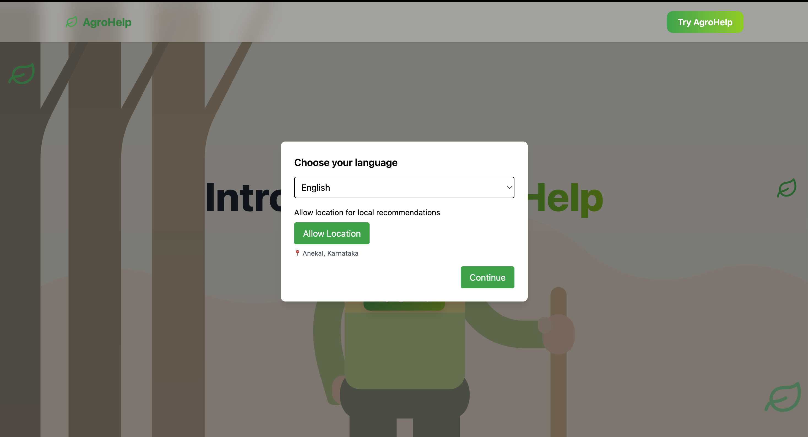
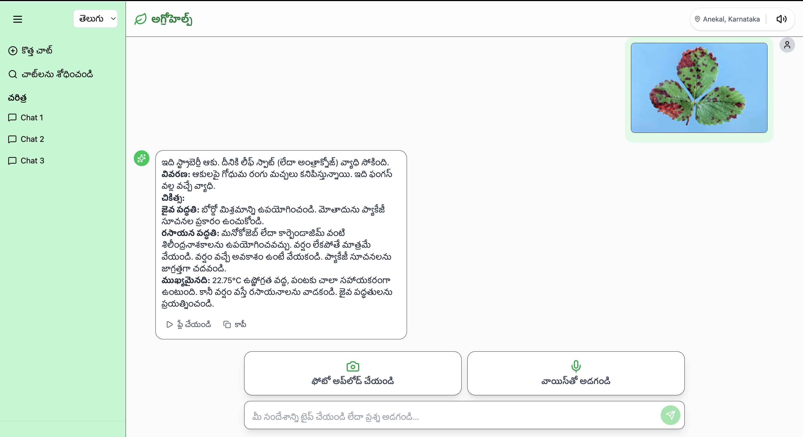
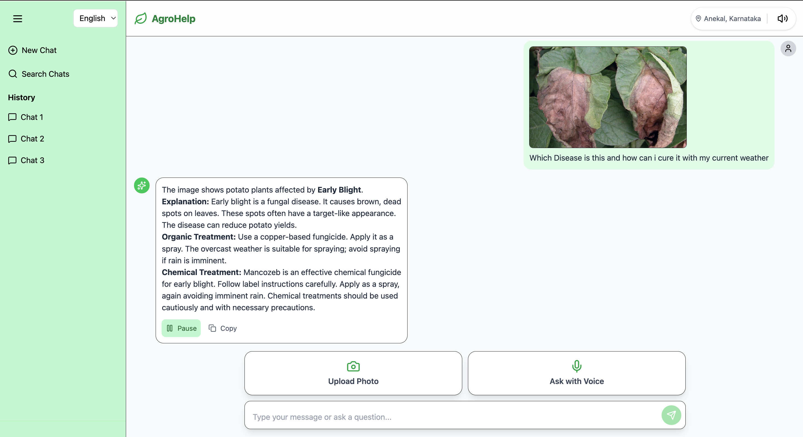
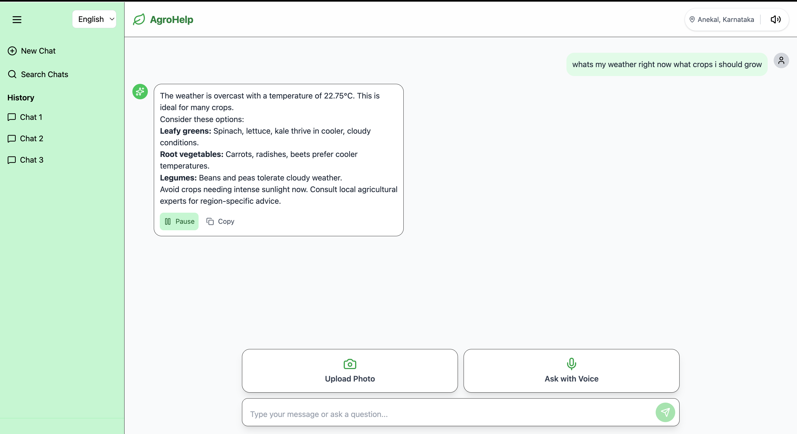

# AgroHelp 🌱

**Team - Sangathan**  

AgroHelp is a hyper-local, multilingual AI-powered advisory platform designed to empower small and marginal farmers across India by bridging the critical information gap in modern agriculture.  

The core of the application is an **intelligent chat assistant** that provides real-time, actionable advice, moving beyond generic recommendations to offer support that is contextually aware of a farmer's specific environment.  

---

## 🚜 Problem Statement  

A majority of small and marginal farmers in India rely on traditional knowledge, local shopkeepers, or guesswork for crop selection, pest control, and fertilizer use. They lack access to personalized, real-time advisory services that account for soil type, weather conditions, and crop history.  

This often leads to poor yield, excessive input costs, and environmental degradation due to overuse of chemicals. Language barriers, low digital literacy, and absence of localized tools further limit their access to modern agri-tech resources.  

---

## 🌍 Why This Matters  

Helping small farmers make informed decisions can:  

- Increase productivity  
- Reduce costs  
- Improve livelihoods  
- Contribute to sustainable farming practices  
- Enhance food security & environmental conservation  

---

## 🎯 Key Features Implemented  

- **Multilingual Chat Assistant**: English, Hindi, Telugu with voice and text support.  
- **Accessibility-First Design**: Voice & image-based interactions for low digital literacy users.  
- **Image Disease Recognition**: Upload plant leaf images to detect crop diseases & get remedies.  
- **Smart Weather-Aware Advisory**: Context-aware recommendations integrated with OpenWeatherMap API.  
- **Voice Response System**: Every AI response is read aloud using Text-to-Speech in multiple languages.  
- **Responsive UI**: Optimized for both desktop and mobile.  

---

## 🛠 Tech Stack  

**Frontend**: React.js, Tailwind CSS, Web Speech API, Web Audio API  
**Backend**: FastAPI (Python)  
**Database**: PostgreSQL  

**AI/ML & Processing Pipelines**:  
- Core Frameworks: PyTorch, TensorFlow  
- Key Architecture: Vision Transformer (ViT)  
- Image Processing: Laplacian Variance, CLAHE, SRGAN  
- Audio Processing: Bandpass Filter, Spectral Gating, AGC  

**APIs**:  
- API for NLU & Translation. 
- Google STT (Dialect-Aware Speech-to-Text)    
- Weather & Market Price APIs  

**Deployment & DevOps**: Docker, Kubernetes, GitHub Actions, AWS/GCP  

---  

## 📸 Demo  

### Landing Page  
  

### Multilingual Response  
  

### Image Disease Detection with Voice supported Response  
  

### Weather-based Recommendation  
  


---

## 📊 Stakeholders / Beneficiaries  

- Small & marginal farmers  
- Agricultural extension officers  
- Government agriculture departments  
- NGOs & cooperatives  
- Agri-tech startups  

---

## 📌 Supporting Data  

- **86%** of Indian farmers are small or marginal (NABARD Report, 2022).  
- ICT-based advisories can increase crop yield by **20–30%**.  

---

## 🚧 Challenges  

- Handling dialect & accent diversity in speech inputs.  
- Building lightweight models suitable for low-connectivity rural areas.  
- Ensuring trustworthiness of recommendations.  
- Managing multilingual translations in real time.  

---

## 🚀 Upcoming Features  

- Soil health recommendations & fertilizer guidance.  
- Weather-based alerts & predictive insights.  
- Market price tracking & advisory.  
- Feedback & usage data collection for continuous improvement.  

---

## 📢 Expected Outcomes  

- A robust multilingual AI assistant for farming advisory.  
- Personalized, real-time, location-specific recommendations.  
- Reduction in overuse of chemicals & improved soil health.  
- Better decision-making support for farmers.  

---

## 👨‍👩‍👧 Team - Sangathan  

We are a group of innovators passionate about empowering farmers through technology. By leveraging AI, we aim to bridge the information gap and create a more sustainable agricultural future.  

---


---

## 💻 Running AgroHelp Locally  

### Backend  

```bash
python3 -m venv venv
source venv/bin/activate
pip install -r requirements.txt
uvicorn main:app --reload
```

### Frontend  

```bash
npm i
npm run dev
```

---

## 🤝 Contributing  

1. Fork the repository  
2. Clone your fork locally  
3. Create a new branch for your feature/fix  
4. Commit your changes and push to your fork  
5. Create a Pull Request describing your changes  

We welcome contributions in the areas of bug fixes, feature development, documentation, and testing.  


## 📜 License  

This project is developed as part of a collaborative effort. Licensing terms to be finalized.  

---

Made with ❤️ by **Team Sangathan**  
